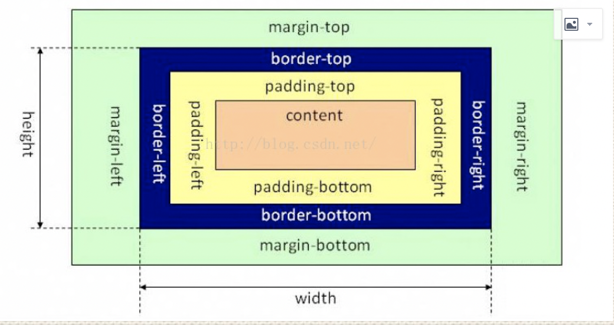

# CSS

### CSS 选择符有哪些？
 - id选择器
 - class选择器
 - 标签选择
 - 后代选择 （div a）
 - 子代选择 （div > p）
 - 相邻选择 （div + p）
 - 通配符选择 （*）
 - 属性选择器
 - 伪类选择器


### CSS3属性选择器
| 选择器 | 描述 |
| - | - |
|[attribute]	|用于选取带有指定属性的元素。|
|[attribute=value]	|用于选取带有指定属性和值的元素。|
|[attribute~=value]	|用于选取属性值中包含指定词汇的元素。|
|[attribute\|=value]	|用于选取带有以指定值开头的属性值的元素，该值必须是整个单词。|
|[attribute^=value]	|匹配属性值以指定值开头的每个元素。|
|[attribute$=value]	|匹配属性值以指定值结尾的每个元素。|
|[attribute*=value]	|匹配属性值中包含指定值的每个元素。|


### CSS3伪类选择器

[伪类 | MDN](https://developer.mozilla.org/zh-CN/docs/Web/CSS/Pseudo-classes#%E6%A0%87%E5%87%86%E4%BC%AA%E7%B1%BB%E7%B4%A2%E5%BC%95)
常用：

 - :hover
 - :focus
 - :after 在元素之前添加内容,也可以用来做清除浮动。
 - :before 在元素之后添加内容
 - :enabled 选择器匹配每个已启用的元素（大多用在表单元素上）。
 - :disabled 控制表单控件的禁用状态。
 - :checked 单选框或复选框被选中
 - ::selection  用户选中的区域
 - :empty   一般用来隐藏内部什么都没有的元素
 - :not(selecter)
 - 
 - p:first-of-type 
 - p:last-of-type 
 - p:only-of-type 
 - p:nth-of-type(n)
 - p:nth-last-of-type(n)
 - 
 - :nth-child(n)
 - :nth-last-child(n)
 - p:only-child 


### display: none; 与 visibility: hidden; 的区别

相同： 它们都能让元素不可见

区别：

- display:none;会让元素完全**从渲染树中消失**，渲染的时候不占据任何空间；visibility: hidden;不会让元素从渲染树消失，渲染时元素继续占据空间，只是内容不可见
- display: none;是非继承属性，子孙节点消失由于元素从渲染树消失造成，通过修改子孙节点属性无法显示；visibility:hidden;是继承属性，子孙节点消失由于继承了 hidden，通过设置 **visibility: visible;可以让子孙节点显式**
- 修改常规流中元素的 display 通常会造成文档**重排**。修改 visibility 属性只会造成本元素的重绘
- 读屏器不会读取 display: none;元素内容；会读取 visibility: hidden 元素内容


### 外边距折叠(collapsing margins)

外边距重叠就是 margin-collapse

相邻的两个盒子（可能是兄弟关系也可能是祖先关系）的外边距可以结合成一个单独的外边距。 这种合并外边距的方式被称为折叠，结合而成的外边距称为折叠外边距

折叠结果遵循下列计算规则：

- 两个相邻的外边距都是正数时，折叠结果是它们两者之间较大的值
- 两个相邻的外边距都是负数时，折叠结果是两者绝对值的较大值
- 两个外边距一正一负时，折叠结果是两者的相加的和

新手在做导航栏的时候发现页面整体掉下来一截就是这个原因。


### 介绍一下标准的 CSS 的盒子模型？低版本 IE 的盒子模型有什么不同的？
 有两种， IE 盒子模型、W3C 盒子模型；

盒模型： 内容(content)、填充(padding)、边界(margin)、 边框(border)；

- 区 别： IE 的 content 部分把 border 和 padding 计算了进去;
- 标准浏览器通过设置 css3 的 box-sizing: border-box 属性，触发“怪异模式”解析计算宽高

标准(W3C)盒模型：元素宽度 = width + padding + border + margin


怪异(IE)盒模型：元素宽度 = width + margin



### 单行文本溢出显示省略号
```css
overflow: hidden;
text-overflow: ellipsis;
white-space: no-wrap;
```


### 多行文本溢出显示省略号
```css
overflow: hidden;
text-overflow: ellipsis;
display: -webkit-box;
-webkit-line-clamp: 3;
-webkit-box-orient: vertical;
```


### link 与 @import 的区别

- link 是 HTML 方式， @import 是 CSS 方式
- link 最大限度支持并行下载，@import 过多嵌套导致串行下载，出现 FOUC
- link 可以通过 rel="alternate stylesheet" 指定候选样式
- 浏览器对 link 支持早于@import ，可以使用 @import 对老浏览器隐藏样式
- @import 必须在样式规则之前，可以在 css 文件中引用其他文件
- 总体来说：link 优于@import


### CSS 有哪些继承属性

- 关于文字排版的属性如：
  - font
  - word-break
  - letter-spacing
  - text-align
  - text-rendering
  - word-spacing
  - white-space
  - text-indent
  - text-transform
  - text-shadow
- line-height
- color
- visibility
- cursor


### 如何水平居中一个元素？
如果需要居中的元素为inline或inline-block，为父元素设置 `text-align: center;`即可实现

如果要居中的元素为一个块级元素的话，一般使用 `margin: 0 auto;` 进行居中。


### 如何竖直居中一个元素
参考代码: [CSS/居中元素/垂直居中]()
#### 被居中元素宽高固定

1. 绝对定位，top和left 为 50%， margin的left和top为自身宽高一半
```css
.center {
  position: absolute;
  top: 50%;
  left: 50%;
  margin-left: -9rem;
  margin-top: -5rem;
}
```

2. 绝对定位，top和lefe为父元素一半剪自身一半
```css
.center {
  position: absolute;
  top: calc(50% - 5em);
  left: calc(50% - 9em);
}
```

#### 被居中元素宽高不定
3. 使用CSS3 的 `transform`将位置在中心点平移自身宽高一半
```css
.center {
  position: absolute;
  top: 50%;
  left: 50%;
  transform: translate(-50%, -50%);
}
```

4. 使用flex布局居中
```css
.wrapper {
  display: flex;
}
.center {
  margin: auto;
}
```

5. flex布局，父元素指定子元素居中。
```css
.wrapper {
  display: flex;
  align-items: center;
  justify-content: center;
}
```

#### 在浏览器窗口中居中
基于视口的垂直居中。不要求原生有固定的宽高，但是这种居中是在整个页面窗口内居中，不是基于父元素
```css
margin: 50vh auto;
transform: translateY(-50%);
```
