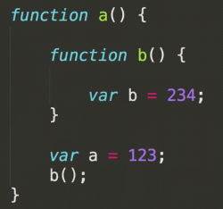
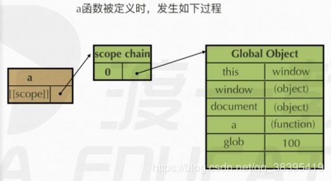
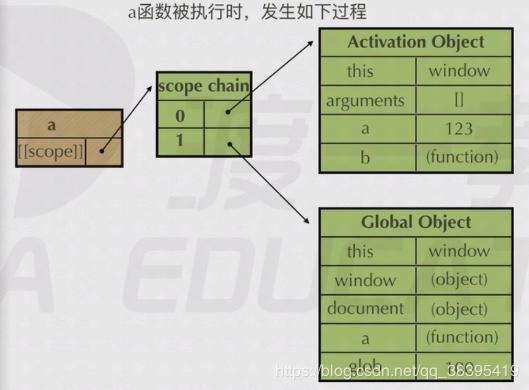
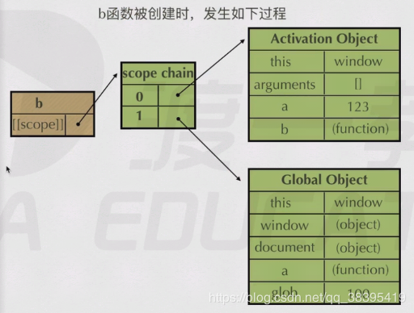
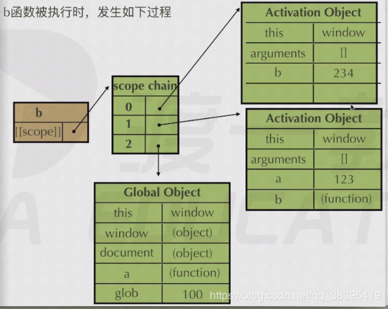

# 函数

### 预编译

### JS运行分三步：
语法分析（通篇扫描是否有语法错误），预编译（发生在函数执行的前一刻），解释执行（一行行执行）。


### 预编译执行分五步：
一、创建AO对象（Activation Object  执行期上下文）

二、找形参和变量声明，将变量和形参名作为AO属性名，值为undefined.
    变量声明提升（变量放到后面也不会报错，只是未定义类型）如：console.log(a);var a=10;结果undenfined;

三、将实参值和形参统一（传参）

四、在函数体里面找到函数声明{函数声明整体提升（相当于放到程序最前面）}

五、值赋予函数体，执行（声明函数和变量的部分直接不看了）


### 函数作用域[[scope]]

每个javascript函数都是一个对象，对象中有的属性可以访问，有的不能，这些属性仅供javascript引擎存取，如[[scope]]。

[[scope]]就是函数的作用域，其中存储了执行期上下文的集合。

**执行期上下文**： 当函数执行时，会创建一个称为执行期上下文的内部对象（AO）。一个执行期上下文定义了一个函数执行时的环境，函数每次执行时对应的执行期上下文都是独一无二的，所以多次调用一个函数会导致创建多个执行期上下文，当函数执行完毕，它所产生的执行上下文被销毁。


### 作用域链
`[[scope]]`中所存储的执行期上下文对象的集合，这个集合呈链式链接，我们称这种链式链接为作用域链。查找变量时，要从作用域链的顶部开始查找。Activation Object（AO）到Global Object（GO）。








### 闭包

当内部函数被保存到外部时，将会生成闭包。生成闭包后，内部函数依旧可以访问其所在的外部函数的变量。

详细解释：

当函数执行时，会创建一个称为**执行期上下文的内部对象（AO）**，执行期上下文定义了一个函数执行时的环境。

函数还会获得它所在作用域的**作用域链**，是存储函数能够访问的所有执行期上下文对象的集合，即这个函数中能够访问到的东西都是沿着作用域链向上查找直到全局作用域。

函数每次执行时对应的执行期上下文都是独一无二的，当函数执行完毕，函数都会失去对这个作用域链的引用，JS的垃圾回收机制是采用引用计数策略，如果一块内存不再被引用了那么这块内存就会被释放。

但是，当闭包存在时，即内部函数保留了对外部变量的引用时，这个作用域链就不会被销毁，此时内部函数依旧可以访问其所在的外部函数的变量，这就是闭包。


先看两个例子，两个例子都打印5个5
```js
for (var i = 0; i < 5; i++) {
  setTimeout(function timer() {
    console.log(i)
  }, i * 100)
}
```

```js
function test() {
   var a = [];
   for (var i = 0; i < 5; i++) {
         a[i] = function () {
            console.log(i);
         }
   }
   return a;
}

var myArr = test();
for(var j=0;j<5;j++)
{
   myArr[j]();
}
```


解决方法： 使用立即执行函数
```js
for (var i = 0; i < 5; i++) {
   ;(function(i) {
      setTimeout(function timer() {
         console.log(i)
      }, i * 100)
   })(i)
}
```
```js
function test(){
   var arr=[];
   for(i=0;i<10;i++)
   {
      (function(j){
         arr[j]=function(){
         console.log(j);
         }
      })(i)
   }
   return arr;
}

var myArr=test();
for(j=0;j<10;j++)
{
   myArr[j]();
}
```


### 闭包-封装私有变量
```js
function Counter() {
   let count = 0;
   this.plus = function () {
      return ++count;
   }
   this.minus = function () {
      return --count;
   }
   this.getCount = function () {
      return count;
   }
}

const counter = new Counter();
counter.puls();
counter.puls();
console.log(counter.getCount())
```


### 作用域与变量声明提升

 - 在 JavaScript 中，函数声明与变量声明会被 JavaScript 引擎隐式地提升到当前作用域的顶部 
 - 声明语句中的赋值部分并不会被提升，只有名称被提升
 - 函数声明的优先级高于变量，如果变量名跟函数名相同且未赋值，则函数声明会覆盖变量声明
 - 如果函数有多个同名参数，那么最后一个参数（即使没有定义）会覆盖前面的同名参数


### 构造函数，new时发生了什么？
 
```javascript
   var obj  = {}; 
   obj.__proto__ = Base.prototype;
   Base.call(obj);  
```

1. 创建一个新的对象 obj;
2. 将这个空对象的__proto__成员指向了Base函数对象prototype成员对象
3. Base函数对象的this指针替换成obj, 相当于执行了Base.call(obj);
4. 如果构造函数显示的返回一个对象，那么则这个实例为这个返回的对象。 否则返回这个新创建的对象


### map
map 作用是生成一个新数组，遍历原数组，将每个元素拿出来做一些变换然后返回一个新数组，原数组不发生改变。

map 的回调函数接受三个参数，分别是当前索引元素，索引，原数组
```js
var arr = [1,2,3];
var arr2 = arr.map(item => item + 1)    
arr   //[ 1, 2, 3 ]
arr2  // [ 2, 3, 4 ]
```

```js
['1','2','3'].map(parseInt)
// -> [ 1, NaN, NaN ]
```
 - 第一个 parseInt('1', 0) -> 1
 - 第二个 parseInt('2', 1) -> NaN
 - 第三个 parseInt('3', 2) -> NaN


### filter
filter 的作用也是生成一个新数组，在遍历数组的时候将返回值为 true 的元素放入新数组，我们可以利用这个函数删除一些不需要的元素

filter 的回调函数接受三个参数，分别是当前索引元素，索引，原数组


### reduce
reduce 可以将数组中的元素通过回调函数最终转换为一个值。
如果我们想实现一个功能将函数里的元素全部相加得到一个值，可能会这样写代码
```js
const arr = [1, 2, 3]
let total = 0
for (let i = 0; i < arr.length; i++) {
  total += arr[i]
}
console.log(total) //6 
```
但是如果我们使用 reduce 的话就可以将遍历部分的代码优化为一行代码
```js
const arr = [1, 2, 3]
const sum = arr.reduce((acc, current) => acc + current, 0)
console.log(sum)
```
对于 reduce 来说，它接受两个参数，分别是回调函数和初始值，接下来我们来分解上述代码中 reduce 的过程
 - 首先初始值为 0，该值会在执行第一次回调函数时作为第一个参数传入
 - 回调函数接受四个参数，分别为累计值、当前元素、当前索引、原数组，后三者想必大家都可以明白作用，这里着重分析第一个参数
 - 在一次执行回调函数时，当前值和初始值相加得出结果 1，该结果会在第二次执行回调函数时当做第一个参数传入
 - 所以在第二次执行回调函数时，相加的值就分别是 1 和 2，以此类推，循环结束后得到结果 6


### 生成器原理

当yeild产生一个值后，生成器的执行上下文就会从栈中弹出。但由于迭代器一直保持着队执行上下文的引用，上下文不会丢失，不会像普通函数一样执行完后上下文就被销毁。


### 为什么要使用模块化？都有哪几种方式可以实现模块化，各有什么特点？

模块化可以给我们带来以下好处

 - 解决命名冲突
 - 提供复用性
 - 提高代码可维护性

实现模块化方式：
 - 立即执行函数
 - AMD 和 CMD
 - CommonJS
 - ES Module


在早期，使用立即执行函数实现模块化是常见的手段，通过函数作用域解决了命名冲突、污染全局作用域的问题
```js
(function() {
   function Model() {
      // ...
   }
   Model.prototype.someFunc = function() {
      // ...
   }

   Window.Some = Model;
})()
```


### CommonJS
Node中使用
用法
```js
// a.js
module.exports = {
    a: 1
}
// or 
exports.a = 1

// b.js
var module = require('./a.js')
module.a // -> log 1
```

原理
```js
var module = require('./a.js')
module.a 
// 这里其实就是包装了一层立即执行函数，这样就不会污染全局变量了，
// 重要的是 module 这里，module 是 Node 独有的一个变量
module.exports = {
    a: 1
}
// module 基本实现
var module = {
  id: 'xxxx', // 我总得知道怎么去找到他吧
  exports: {} // exports 就是个空对象
}
// 这个是为什么 exports 和 module.exports 用法相似的原因
var exports = module.exports 
var load = function (module) {
    // 导出的东西
    var a = 1
    module.exports = a
    return module.exports
};
// 然后当我 require 的时候去找到独特的
// id，然后将要使用的东西用立即执行函数包装下，over
```


### ES Module
ES Module 是原生实现的模块化方案，与 CommonJS 有以下几个区别

 - CommonJS 支持动态导入，也就是 require(${path}/xx.js)，后者目前不支持，但是已有提案
 - CommonJS 是同步导入，因为用于服务端，文件都在本地，同步导入即使卡住主线程影响也不大。而后者是异步导入，因为用于浏览器，需要下载文件，如果也采用同步导入会对渲染有很大影响
 - CommonJS 在导出时都是值拷贝，就算导出的值变了，导入的值也不会改变，所以如果想更新值，必须重新导入一次。但是 ES Module 采用实时绑定的方式，导入导出的值都指向同一个内存地址，所以导入值会跟随导出值变化
 - ES Module 会编译成 require/exports 来执行的

```js
// 引入模块 API
import XXX from './a.js'
import { XXX } from './a.js'
// 导出模块 API
export function a() {}
export default function() {}
```


### 函数参数是对象会发生什么问题？

```javascript
function test(person) {
  person.age = 26
  person = {
    name: 'yyy',
    age: 30
  }

  return person
}
const p1 = {
  name: 'hy',
  age: 25
}
const p2 = test(p1)
console.log(p1) // -> {name: "hy", age: 20}
console.log(p2) // -> {name: "yyy", age: 30}
```

`person = {}` 这一步操作就将应用与原来的分离了

