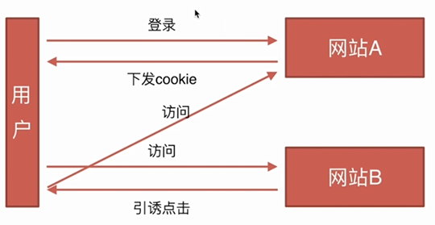

# CSRF 跨站请求伪造
（Cross Site Request Forgy）
打开同一浏览器时其他的网站对本网站造成的影响。

## CSRF攻击原理
1. 用户登录A网站
2. A网站确认身份
3. B网站页面向A网站发起请求（带上A网站身份）

## CSRF防御
 - Token验证
   - cookie是发送时自动带上的，而不会主动带上Token，所以在每次发送时主动发送Token
 - Referer验证
   - 判断页面来源
 - 隐藏令牌
   - 主动在HTTP头部中添加令牌信息

## CSRF蠕虫
如果某个用户打开了被攻击网页，并且用户同时访问了攻击者的网页。
那么攻击者的网页就会使用用户的身份发送一些请求，并且常用用户的身份发布一些评论或文章，里面包含攻击者的网页链接。如果其他用户看到了这个用户的这条评论，都甚至可以不点击，其他用户也会被盗用身份发送一些恶意请求。这样病毒的传播就会越来越快，影响越来越大。

## CSRF攻击危害
 - 利用用户登录态
 - 用户不知情
 - 完成业务请求
 - 
 - 盗取用户资金
 - 冒充用户发帖背锅
 - 损坏网站名誉

## CSRF防御
禁止第三方网站带cookies

[same-site](https://developer.mozilla.org/zh-CN/docs/Web/HTTP/Cookies#SameSite_Cookies)属性。 设置只有同一站点的请求才能携带cookie